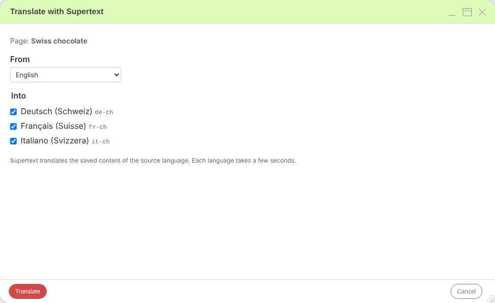

# Supertext Translation for django CMS

Translate django CMS pages into the site's other languages with **Supertext AI**, right from the toolbar.

In edit mode, choose **Language → Translate with Supertext…**, tick the languages and click **Translate**: the page's title, menu title, meta description and the texts of its plugins go to Supertext in one request per language and come back as a new language version of the page, with all plugins in place. Editors review and adjust it like any other page content.

- Uses django CMS's own languages and page contents; works with djangocms-versioning (new languages are drafts)
- Text plugins keep their headings, bold text, links and lists; whole paragraphs are translated in context
- Translated URL slugs for new languages
- Languages that exist are kept unless the editor explicitly overwrites them
- Text, Link, Picture, File and Video plugins out of the box; more plugin fields by setting
- Formal or informal tone and custom Supertext language codes per language
- A settings page with *Test connection*, a translation log, management commands



## Documentation

| Guide | For |
| --- | --- |
| [Installation guide](docs/INSTALLATION.md) | Administrators and developers: requirements, install, API key, languages, permissions, settings, troubleshooting |
| [User guide](docs/USER_GUIDE.md) | Editors: translating, reviewing, overwriting, what gets translated |
| [Developer guide](docs/DEVELOPER.md) | Architecture, API protocol, local development, tests, demo deployment, releases |

Requires a Supertext account ([create one or log in](https://www.supertext.com/person/en/account/signin)) and an API key from [supertext.com → Integrations → API](https://www.supertext.com/en/integrations/api) (Admin role in the Supertext account).

Quick start:

```bash
pip install git+https://github.com/Supertext/djangoCMS-Supertext-Translation.git
```

```python
# settings.py
INSTALLED_APPS += ["djangocms_supertext"]
# environment: SUPERTEXT_API_KEY="…"
```

```bash
python manage.py migrate djangocms_supertext
```

## Demo

`demo/` is a django CMS 5 site with English sample pages and German, French and Italian (Switzerland), deployed to Railway from this repository. See the [developer guide](docs/DEVELOPER.md#demo-railway).

Part of Supertext's translation plugins for open source CMSs, alongside [Wagtail](https://github.com/Supertext/Wagtail-Supertext-Translation), [WordPress](https://github.com/Supertext/supertext-wordpress-polylang), [Drupal](https://www.drupal.org/project/tmgmt_supertext_ai) and others.

## Changelog and roadmap

See [CHANGELOG.md](CHANGELOG.md) and the [roadmap](docs/DEVELOPER.md#known-limitations--roadmap).

<!-- supertext-plugins:start (shared list, keep identical in every Supertext plugin repo) -->
## Supertext plugins for other systems

Supertext offers AI and professional translation plugins for these systems:

### Content management systems (CMS)

| System | Plugin | Type of integration | What it does |
| --- | --- | --- | --- |
| Adobe Experience Manager | [supertext-aem-connector](https://github.com/Supertext/supertext-aem-connector) | Translation connector: two AEM content packages for AEM's Translation Integration Framework. | Sends AEM translation projects to Supertext and imports the results |
| Contao | [Contao-Supertext-Translation](https://github.com/Supertext/Contao-Supertext-Translation) | Contao bundle (Composer) that adds a back-end action. | *Translate with Supertext* in the site structure: pages or whole websites into other languages |
| Craft CMS | [CraftCms-Supertext-Translation](https://github.com/Supertext/CraftCms-Supertext-Translation) | Craft plugin (Composer) with a panel on the entry page. | Translates entries into your other sites, Matrix and rich text included |
| Directus | [Directus-Supertext-Translation](https://github.com/Supertext/Directus-Supertext-Translation) | Directus extension bundle (npm): interface, endpoint, Flow operation and module. | *Translate with Supertext* box on the item form, fills the Translations field |
| django CMS | [djangoCMS-Supertext-Translation](https://github.com/Supertext/djangoCMS-Supertext-Translation) | Django app (Python package) that adds a toolbar entry. | Translates pages and their plugins from the toolbar |
| Drupal | [tmgmt_supertext_ai](https://www.drupal.org/project/tmgmt_supertext_ai) | Drupal module: a translator provider for the Translation Management Tool (TMGMT), by MD Systems. | Translates TMGMT jobs with Supertext AI |
| Ghost | [Ghost-Supertext-Translation](https://github.com/Supertext/Ghost-Supertext-Translation) | Separate connector service (Ghost has no admin plugins): works through internal tags, webhooks and the Admin API. | Tag a post `#translate-…` and a translated draft appears |
| Grav | [Grav-Supertext-Translation](https://github.com/Supertext/Grav-Supertext-Translation) | Grav 2 plugin with an Admin2 panel. | Supertext panel in the page editor, Markdown kept intact |
| Joomla | [Joomla-Supertext-Translation](https://github.com/Supertext/Joomla-Supertext-Translation) | Joomla system plugin (installable package). | Translates articles into linked, unpublished language versions |
| Magnolia | [Magnolia-Supertext-Translation](https://github.com/Supertext/Magnolia-Supertext-Translation) | Magnolia module. | *In development* |
| Neos | [Neos-Supertext-Translation](https://github.com/Supertext/Neos-Supertext-Translation) | Neos package (Composer) that hooks into the content repository; no new UI. | Translates automatically when an editor creates a page in another language |
| Orchard Core | [OrchardCore-Supertext-Translation](https://github.com/Supertext/OrchardCore-Supertext-Translation) | Orchard Core module (.NET) with an admin page and a localization hook. | Translates content items into other cultures, on demand or on localization |
| Payload CMS | [Payload-Supertext-Translation](https://github.com/Supertext/Payload-Supertext-Translation) | Payload plugin (npm) added to `payload.config`. | *Translate* button for localized collections and globals |
| Silverstripe | [Silverstripe-Supertext-Translation](https://github.com/Supertext/Silverstripe-Supertext-Translation) | Silverstripe module (Composer) on top of Fluent. | Supertext tab translates pages and Elemental blocks into Fluent locales |
| Strapi | [Strapi-Supertext-Translation](https://github.com/Supertext/Strapi-Supertext-Translation) | Strapi 5 plugin (npm) with a Content Manager panel. | Translates entries into other locales from the Content Manager |
| TYPO3 | [Typo3-Supertext-Translation](https://github.com/Supertext/Typo3-Supertext-Translation) | TYPO3 extension (Composer) that hooks into TYPO3's own localization; no new UI. | Translates pages and content elements as editors localize them |
| Umbraco | [Umbraco-Supertext-Translation](https://github.com/Supertext/Umbraco-Supertext-Translation) | Umbraco package (NuGet) with a backoffice extension. | *Translate with Supertext* for pages, block lists and grids included |
| Wagtail | [Wagtail-Supertext-Translation](https://github.com/Supertext/Wagtail-Supertext-Translation) | Python package: a machine translator for wagtail-localize. | Translates pages and snippets inside wagtail-localize's editor |
| WordPress (Polylang) | [supertext-wordpress-polylang](https://github.com/Supertext/supertext-wordpress-polylang) | WordPress plugin: a machine-translation service for Polylang Pro, plus professional translation orders. | AI translation next to DeepL in Polylang, and human translation orders |

### Product information management (PIM)

| System | Plugin | Type of integration | What it does |
| --- | --- | --- | --- |
| Akeneo PIM | [Akeneo-Supertext-Translation](https://github.com/Supertext/Akeneo-Supertext-Translation-) | Symfony bundle (Composer) for the Community Edition, with an action on the product edit form and a System page. | *Translate with Supertext* for products and product models, into your other locales |
| Pimcore | [Pimcore-Supertext-Translation](https://github.com/Supertext/Pimcore-Supertext-Translation) | Pimcore bundle (Composer) with a Pimcore Studio panel. | *In development:* translates documents and data objects into the other languages |
<!-- supertext-plugins:end -->

## License

MIT. © Supertext AG
