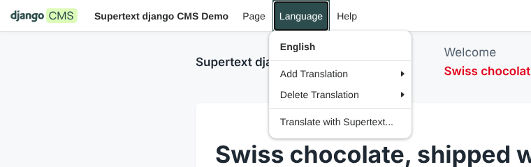

# Installation guide — Supertext Translation for django CMS

For administrators and developers who install and set up the package. Editors find their part in the [user guide](USER_GUIDE.md).

## Requirements

- django CMS 4.1 or later (tested with 5.1), Django 4.2 or later, Python 3.10 or later
- More than one language in `LANGUAGES` / `CMS_LANGUAGES`
- [djangocms-text](https://github.com/django-cms/djangocms-text) (or another text plugin with a `body` field) for rich text
- A Supertext account ([log in or create one](https://www.supertext.com/person/en/account/signin)) and an API key from [supertext.com → Integrations → API](https://www.supertext.com/en/integrations/api) (see [API key](#api-key))
- The server must reach `https://api.supertext.com` over HTTPS

## Install

```bash
pip install git+https://github.com/Supertext/djangoCMS-Supertext-Translation.git
```

(Publishing to PyPI as `djangocms-supertext-translation` is planned.)

Add the app and migrate:

```python
# settings.py
INSTALLED_APPS = [
    ...,
    "djangocms_supertext",
    "cms",
    ...,
]
```

```bash
python manage.py migrate djangocms_supertext
```

No URLs need to be added: the package's pages live in the Django admin. It adds:

- *Translate with Supertext…* to the django CMS toolbar's **Language** menu (edit mode),
- *Supertext → Supertext translations* in the admin (a log of all translations) with *Settings and connection* for superusers,
- the management commands `supertext_translate` and `supertext_check`.

### Update

```bash
pip install --upgrade git+https://github.com/Supertext/djangoCMS-Supertext-Translation.git
python manage.py migrate djangocms_supertext
```

See [CHANGELOG.md](../CHANGELOG.md).

### Uninstall

Remove `"djangocms_supertext"` from `INSTALLED_APPS` after running `python manage.py migrate djangocms_supertext zero` (which drops the translation log), then `pip uninstall djangocms-supertext-translation`. Translations already made are normal page content and stay.

## API key

1. **No Supertext account yet?** [Create one at supertext.com](https://www.supertext.com/person/en/account/signin) (the same page logs you in if you already have one; you sign in with your email address).
2. **Generate the API key** at [supertext.com → Integrations → API](https://www.supertext.com/en/integrations/api). Only users with the **Admin** role in the Supertext account can do this; otherwise ask your account's admin.

Set the key as an environment variable of the server:

```bash
SUPERTEXT_API_KEY="your-key"
```

You can paste it with or without the `Supertext-Auth-Key ` prefix that Supertext shows; the package sends it as `Authorization: Supertext-Auth-Key <key>`. Alternatively set `"API_KEY"` in the `SUPERTEXT` setting (below); the environment variable wins. Keep the key out of your repository.

Check it in the admin under *Supertext → Supertext translations → Settings and connection → Test connection* (superusers), or with `python manage.py supertext_check`. Both call a cost-free endpoint of the Supertext API. While no key is set, the settings page, the translate dialog and `supertext_check` link to the account signup and the API key page.


## Languages

The package translates between the languages django CMS is configured with (`LANGUAGES` and `CMS_LANGUAGES` per site), e.g.:

```python
LANGUAGES = [
    ("en", "English"),
    ("de-ch", "Deutsch (Schweiz)"),
    ("fr-ch", "Français (Suisse)"),
    ("it-ch", "Italiano (Svizzera)"),
]
```

Each language code is sent to Supertext in BCP-47 form (`de-ch` → `de-CH`). Use regional codes where they matter (`de-CH` writes "ss" instead of "ß"). The editors see the languages in the toolbar's *Language* menu:



## Permissions

Editors need:

- **djangocms_supertext | Supertext translation | Can translate pages with Supertext** (`djangocms_supertext.translate`)
- permission to change the page (with `CMS_PERMISSION = True`, django CMS's page permissions; otherwise the model permissions `cms.change_page`, `cms.add_pagecontent`, `cms.change_pagecontent`)
- the permissions of the plugins on the page (e.g. `djangocms_text | text | Can add/change/delete text`), because translating copies the plugins into the target language

Superusers additionally see the settings page. The log (*Supertext translations*) is visible with `djangocms_supertext.view_translation`.

## Settings

All settings are optional and go in one dict:

```python
SUPERTEXT = {
    "API_KEY": "",                    # or the SUPERTEXT_API_KEY environment variable (wins)
    "ENVIRONMENT": "live",            # live | staging | testing
    "API_URL": "",                    # custom base URL; or SUPERTEXT_API_URL (wins)
    "LANGUAGES": {                    # per django CMS language code
        "de-ch": {"politeness": "more"},             # formal (Sie, vous)
        "fr": {"code": "fr-CH", "politeness": "less"},  # other Supertext code, informal (du, tu)
    },
    "TIMEOUT": 180,                   # seconds to wait for one language
    "PLUGIN_FIELDS": {                # more plugin fields to translate (merged with the defaults)
        "HeroPlugin": {"heading": "text", "content": "html"},
    },
}
```

| Key | Default | Description |
| --- | --- | --- |
| `API_KEY` | – | Supertext API key; the environment variable `SUPERTEXT_API_KEY` takes precedence. |
| `ENVIRONMENT` | `live` | `live` (`https://api.supertext.com/v1/`), `staging` or `testing`. |
| `API_URL` | – | A different base URL (proxy, test server); `SUPERTEXT_API_URL` takes precedence. |
| `LANGUAGES` | `{}` | Per language: `code` (the Supertext language, default: the BCP-47 form of the django CMS code) and `politeness` (`more` formal, `less` informal, `default`). |
| `TIMEOUT` | `180` | Seconds to wait for the translation of one language. |
| `POLL_INTERVAL` | `2` | Seconds between status checks. |
| `PLUGIN_FIELDS` | see below | Plugin type → `{model field: "text" or "html"}`. |

**Plugins translated out of the box:** `TextPlugin` (`body`, HTML; djangocms-text and djangocms-text-ckeditor), `LinkPlugin` (`name`; djangocms-link), `PicturePlugin` (`caption_text`), `FilePlugin` (`file_name`), `VideoPlayerPlugin` (`label`). Add your own plugins with `PLUGIN_FIELDS`; all other plugins are copied into the new language unchanged.

## Request timeouts

Translating runs in the editor's request: a few seconds per language, up to `TIMEOUT` for very long pages. Make sure your web server and proxy allow that (e.g. gunicorn `--timeout 300`).

## Troubleshooting

| Symptom | Cause and fix |
| --- | --- |
| No *Translate with Supertext…* in the Language menu | The toolbar isn't in edit mode, the app isn't in `INSTALLED_APPS`, or the user lacks `djangocms_supertext.translate` or permission to change the page. |
| *Supertext is not set up yet* in the dialog | `SUPERTEXT_API_KEY` is not set on the server. Generate a key at [supertext.com → Integrations → API](https://www.supertext.com/en/integrations/api) (Admin role) and set it. |
| *Authentication failed. Please check the Supertext API key.* | Wrong or revoked key, or a key for another environment. Generate a new one at [supertext.com → Integrations → API](https://www.supertext.com/en/integrations/api) (Admin role) and use *Test connection*. |
| *This language is published. Create a draft of it, then translate again.* | With djangocms-versioning, only drafts can be changed. Create a draft of that language (or delete the language) and translate again. |
| *Too many requests to Supertext* | The API's per-second limit was hit repeatedly although the package retries. Try again shortly. |
| *Timed out waiting for the Supertext translation* or a 502/504 from the proxy | Very long page: raise `TIMEOUT` and the web server's request timeout. |
| A plugin's text stays in the source language | Its plugin type isn't in `PLUGIN_FIELDS`. Add it. |
| *Your Supertext translation limit is exceeded.* | The Supertext subscription's quota is used up. |

Errors are also logged (logger `djangocms_supertext`). More technical details are in the [developer guide](DEVELOPER.md).
