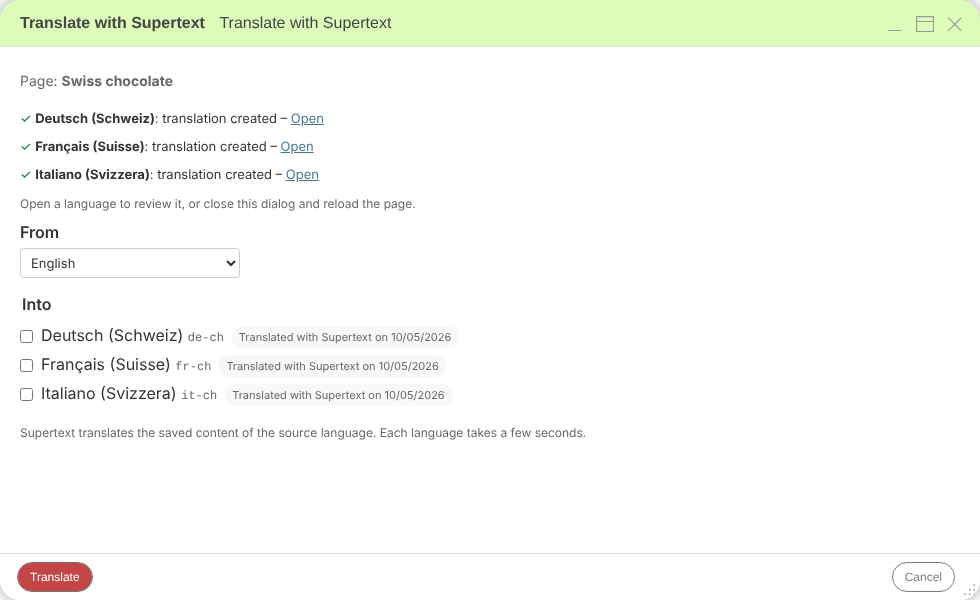
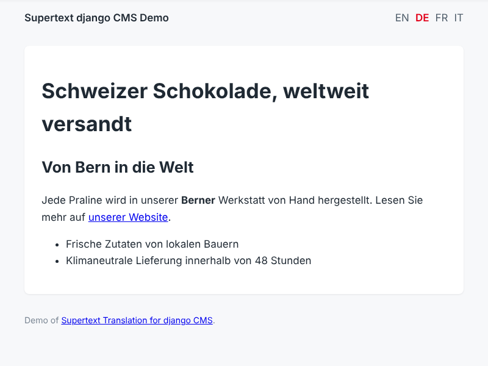
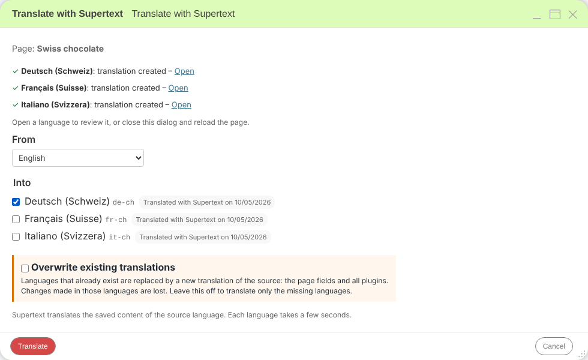
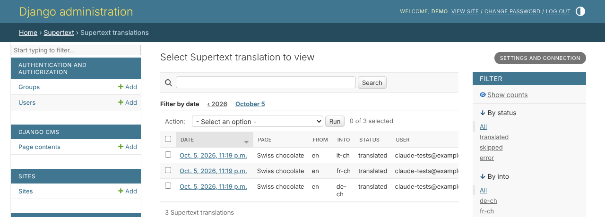

# User guide — Supertext Translation for django CMS

For editors who translate pages with the django CMS toolbar. Your administrator has installed the package and set up the site's languages (see the [installation guide](INSTALLATION.md)).

## Translate a page

1. Open the page in the language you translate **from** (usually English) and switch to **edit mode** (pencil button in the toolbar).
2. Make sure your changes are saved (and, with versioning, that the content you want to translate is the latest version). Supertext translates the saved content.
3. Open the **Language** menu in the toolbar and choose **Translate with Supertext…**.

   

4. In the dialog:
   - **From**: the language to translate from. Only languages the page exists in are offered.
   - **Into**: the languages to create. Languages the page doesn't exist in yet are ticked.
5. Click **Translate**.

Each language takes a few seconds. The dialog then lists the result per language, with an **Open** link to each new version:

## Review the translation

Click **Open** (or switch the language in the toolbar). The translated version is a normal django CMS page content: its title, page title, menu title, meta description and URL slug are translated, and all plugins of the source were copied with their texts translated. Rich text keeps its headings, bold text, links and lists.

Change what you like in edit mode, as if you had translated by hand. With djangocms-versioning, new languages are created as **drafts**: review and publish them as usual.

## Translate again or update a translation

Languages the page already exists in show **Already translated** or **Translated with Supertext on** *date*, and are not ticked. If you tick one, the dialog asks whether to overwrite it:

- Leave **Overwrite existing translations** off: those languages are skipped (*already translated, skipped*); only missing languages are created. Your edits are safe.
- Turn it on: the page fields of those languages are replaced with a new translation, and **all their plugins are replaced** by translated copies of the source's plugins. **Changes made in those languages are lost.** The URL slug of an existing language stays as it is.

With djangocms-versioning, a published language can only be overwritten through a draft: create a draft of it first.

## What is translated

| Content | What happens |
| --- | --- |
| Title, page title, menu title, meta description | Translated |
| URL slug | Made from the translated title when a language is created; kept when overwriting |
| Text plugins | Translated as HTML: headings, bold, italic, links and lists stay in place, link addresses are kept |
| Link, Picture, File and Video plugins | Their text (link name, caption, file name, label) is translated |
| Other plugins | Copied into the new language unchanged (your administrator can add plugin fields to translate) |
| Page settings (template, menu visibility, …) | Copied from the source when a language is created |

Empty fields are skipped.

## The translation log

*Admin → Supertext → Supertext translations* lists every translation: page, languages, result, who started it and when.

## Messages

The Supertext dialog and its messages follow your django CMS interface language (English, German, French or Italian; *site name menu → User settings* in the toolbar).

| Message | Meaning |
| --- | --- |
| *Supertext is not set up yet: …* | No API key on the server. Ask your administrator; the message links to where they create a Supertext account and the API key. |
| *already translated, skipped* | The language exists and *Overwrite existing translations* was off. |
| *The page has no … version to translate from.* | Choose another *From* language. |
| *This language is published. Create a draft of it, then translate again.* | With versioning, overwrite a draft, not the published version. |
| *Authentication failed. Please check the Supertext API key.* | The API key is wrong. Ask your administrator. |
| *Your Supertext translation limit is exceeded.* | Your organisation's Supertext limit is used up. |
| *Too many requests to Supertext. Please try again shortly.* | Supertext was busy; try again in a moment. |
| *Timed out waiting for the Supertext translation.* / *The Supertext service is currently unavailable.* | Supertext took too long or is unavailable. Try again later. |

Errors are shown per language: if one language fails, the others are still created.
